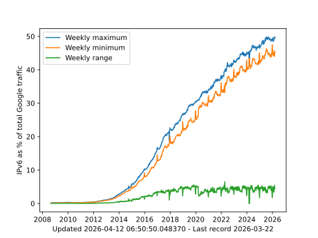

# gipv6minmax

The Google IPv6 statistics at https://www.google.com/intl/en/ipv6/statistics.html appear to have a pattern of higher usage on weekends than weekdays. Maybe caused by lower IPv6 adoption in corporate offices than home or mobile ISPs. In certain periods of the COVID19 pandemic especially in 2020, the weekly minimum gets closer to the maximum, likely due to more people away from the office and working at home. So it is interesting to graph the weekly range, minimum, and maximum values calculated out of the daily values listed in the file https://www.google.com/intl/en_ALL/ipv6/statistics/data/adoption.js and plot these as their own trends.

This image is updated daily by a GitHub Action.

